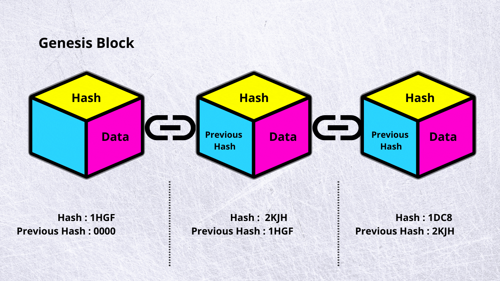
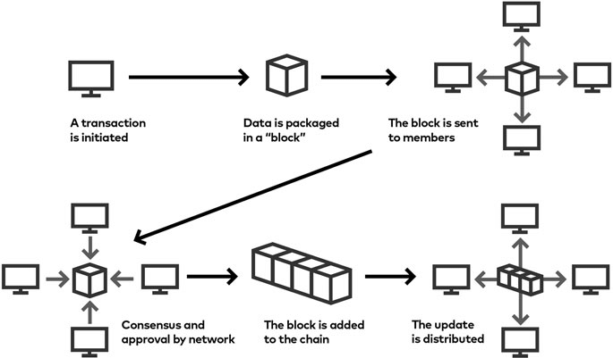
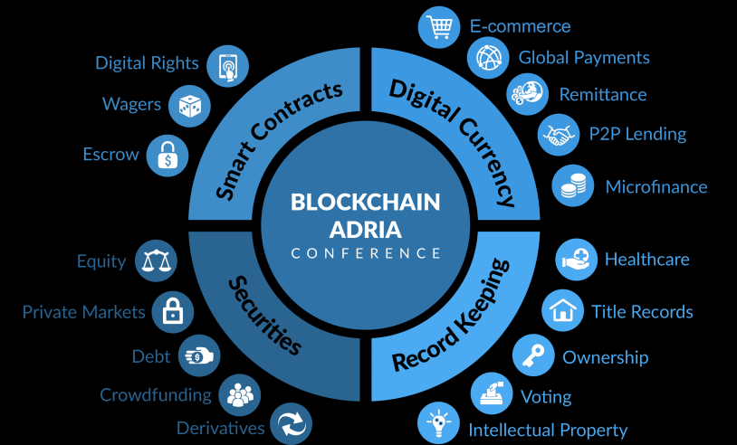

# Blockchain Basics

## What is Blockchain?

Blockchain is a data structure that represents a growing list of records, known as blocks, which are securely linked together using cryptography. It is the backbone technology behind digital cryptocurrencies like Bitcoin. Blockchain ensures that once information is added to a block, it cannot be altered or removed, making it an incorruptible digital ledger of transactions.

### Key Features of Blockchain:

- **Decentralization:** No central authority controls the data; instead, it is distributed across multiple nodes in the network.
- **Transparency:** All transactions are visible to participants in the network, ensuring openness.
- **Security:** Advanced cryptography secures data, preventing unauthorized access and ensuring data integrity.
- **Immutability:** Once data is recorded in a block, it cannot be altered, ensuring a permanent and tamper-proof record.

## How Does Blockchain Work?

1. **Transaction Initiation:** A user initiates a transaction, which is then broadcasted to the network.
2. **Transaction Validation:** Nodes (computers) in the network validate the transaction using consensus mechanisms such as Proof of Work (PoW) or Proof of Stake (PoS).
3. **Block Creation:** Once validated, the transaction is grouped with other transactions to form a block.
4. **Block Addition:** The new block is added to the existing blockchain, creating a chronological chain of transactions.
5. **Ledger Update:** The updated blockchain is distributed across all nodes in the network, ensuring consistency and transparency.

## Blockchain Network Components

- **Nodes:** Computers that participate in the blockchain network by validating and relaying transactions.
- **Miners:** Special nodes that validate transactions and add new blocks to the blockchain in return for rewards.
- **Distributed Ledger:** A digital record of all transactions that is shared across the blockchain network.

## Advantages of Blockchain Technology

- **Decentralization:** Eliminates the need for intermediaries, reducing costs and increasing efficiency.
- **Enhanced Security:** Cryptographic techniques ensure data is secure and tamper-proof.
- **Transparency:** Every transaction is recorded and visible to all participants in the network.
- **Increased Efficiency:** Faster transaction settlements as there is no need for central authority verification.

## Disadvantages of Blockchain Technology

- **Scalability:** Difficulty in handling a large number of transactions simultaneously.
- **Energy Consumption:** High computational power required for mining processes, leading to increased energy usage.
- **Regulatory Challenges:** Unclear regulations can create uncertainty for businesses and users.
- **Adoption Barriers:** Technical complexity and lack of understanding can hinder widespread adoption.

## Applications of Blockchain

- **Cryptocurrencies:** The most popular application, with Bitcoin being the prime example.
- **Supply Chain Management:** Enhances transparency and traceability of goods throughout the supply chain.
- **Healthcare:** Securely stores and shares patient records and medical data.
- **Finance:** Enables faster and cheaper cross-border transactions and settlements.
- **Voting Systems:** Ensures secure, transparent, and tamper-proof electronic voting.

## Multiple-Choice Questions (MCQs)

1. **What is a blockchain?**

   - A. A centralized database
   - B. A distributed ledger technology
   - C. A type of cryptocurrency
   - D. An encrypted messaging system

2. **Which feature of blockchain ensures data cannot be altered once added?**

   - A. Decentralization
   - B. Transparency
   - C. Immutability
   - D. Efficiency

3. **What is the role of miners in a blockchain network?**

   - A. To initiate transactions
   - B. To validate transactions and add new blocks
   - C. To regulate the blockchain network
   - D. To store data securely

4. **Which consensus mechanism is commonly used in blockchain?**

   - A. Proof of Authority (PoA)
   - B. Proof of Work (PoW)
   - C. Proof of Existence (PoE)
   - D. Proof of Integrity (PoI)

5. **What is a node in the blockchain network?**
   - A. A block of data
   - B. A computer participating in the network
   - C. A type of cryptocurrency
   - D. A consensus mechanism

---

- **Answer 1:** B. A distributed ledger technology.
- **Answer 2:** C. Immutability.
- **Answer 3:** B. To validate transactions and add new blocks
- **Answer 4:** B. Proof of Work (PoW)
- **Answer 5:** B. A computer participating in the network

## Conclusion

Blockchain technology is a revolutionary concept that offers secure, transparent, and decentralized solutions for various applications. Its ability to provide a tamper-proof digital ledger has made it the backbone of cryptocurrencies and a promising technology for many other industries.

## References

- Google
- Medium
- Wikipedia
- ChatGPT
- Notes from YouTube