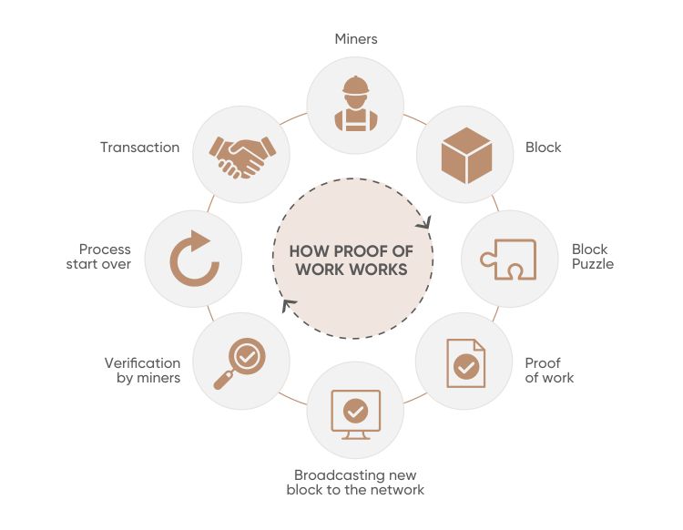

# Blockchain – Proof of Work (PoW)

Proof of Work (PoW) is a consensus mechanism used by many cryptocurrencies to verify transactions and create new blocks in a blockchain. The concept was first proposed by Cynthia Dwork and Moni Naor in 1993 and later applied by Satoshi Nakamoto in the Bitcoin whitepaper in 2008. The term "proof of work" was first coined by Markus Jakobsson and Ari Juels in 1999.

## Purpose of PoW

The primary goal of PoW is to ensure consensus among nodes in a distributed network, even when these nodes may not trust each other. It achieves this by requiring participants to perform computational work that is difficult to solve but easy to verify.

## Principle

The principle behind PoW is to find a solution to a problem that is:

1. **Difficult to solve**: Requires significant computational effort.
2. **Easy to verify**: Once a solution is found, it can be quickly and easily verified by other nodes.

## How Proof of Work (PoW) Works

### Step-by-Step Example

1. **Transaction Bundle**:

   - Imagine a group of people wants to make transactions using a cryptocurrency like Bitcoin. These transactions are grouped into a block.
   - Example: Alice sends 1 BTC to Bob, Charlie sends 2 BTC to Dave, etc.

2. **Puzzle Creation**:

   - The blockchain network creates a complex mathematical puzzle for miners to solve. The puzzle involves finding a nonce (a random number) that, when combined with the block’s data and hashed, produces a hash value less than a specified target.
   - The target is a number that the resulting hash must be less than, ensuring the difficulty of the puzzle.

3. **Mining Process**:

   - Miners start trying different nonce values to solve the puzzle. This requires significant computational effort and time because the hash function produces a seemingly random output, making it hard to predict which nonce will work.
   - Example: A miner tries nonce values 1000, 1001, 1002, and so on, hashing each one with the block’s data until finding a valid hash.

4. **Solution Found**:

   - The first miner to find a valid nonce broadcasts the solution to the network.
   - Example: Miner X finds that nonce 1050 produces a hash less than the target.

5. **Verification**:

   - Other nodes in the network verify the solution. If valid, the new block is added to the blockchain.
   - Example: Other miners check that nonce 1050 with the block’s data indeed produces a valid hash.

6. **Reward**:
   - The miner who solved the puzzle is rewarded with cryptocurrency (e.g., Bitcoin) and any transaction fees associated with the transactions in the block.
   - Example: Miner X receives 6.25 BTC as a reward.

## Halving Cycle

### What is Halving?

- **Definition**: Halving is a process that reduces the reward for mining new blocks by half. This event occurs approximately every four years.
- **Purpose**: To control the supply of cryptocurrency and reduce inflation over time.

### How Halving Works

1. **Initial Reward**:

   - When Bitcoin was created, the reward for mining a new block was 50 BTC.

2. **First Halving**:

   - After 210,000 blocks were mined (approximately four years), the reward was halved to 25 BTC.

3. **Subsequent Halvings**:
   - The process continues approximately every four years:
     - Second Halving: 25 BTC reduced to 12.5 BTC.
     - Third Halving: 12.5 BTC reduced to 6.25 BTC.
     - Next Halving (expected around 2024): 6.25 BTC will be reduced to 3.125 BTC.

### Impact of Halving

- **Supply Control**: Limits the number of new Bitcoins created, aiming for a total supply of 21 million Bitcoins.
- **Market Effect**: Historically, halvings have led to increases in Bitcoin’s price due to reduced supply and continued demand.
- **Miner Incentives**: Reduces the reward for miners, potentially impacting the number of active miners and the network’s security.

### Example: Bitcoin’s PoW System

Bitcoin uses the Hashcash Proof of Work system. The goal is to find a nonce such that when it is appended to the block’s data and hashed, the result is a number less than the target hash. This ensures the solution is sufficiently difficult to find but easy for others to verify.

## Features of PoW

1. **Difficulty Adjustment**: The network periodically adjusts the difficulty of the mathematical problem to ensure that blocks are mined at a consistent rate, approximately every 10 minutes for Bitcoin.
2. **Security**: PoW provides security by making it computationally expensive to add new blocks, thereby deterring malicious actors.

## Energy and Time Consumption

- **High Energy Consumption**: Solving the PoW puzzle requires substantial computational power, leading to high energy consumption.
- **Time-Consuming**: Miners must try many different nonce values before finding a valid one, making the process time-consuming.

## Mining Reward

- **Bitcoin Reward**: Currently, miners receive 6.25 bitcoins for successfully mining a block. This reward is halved approximately every four years.
- **Transaction Fees**: Miners also earn transaction fees from the transactions included in the block.

## Challenges with PoW

1. **51% Attack**: If an entity controls more than 51% of the network’s hash rate, it can potentially manipulate the blockchain.
2. **Resource Consumption**: PoW is resource-intensive, requiring significant amounts of energy and computational power.
3. **Non-Instantaneous Transactions**: It can take 10-60 minutes for a transaction to be confirmed, making PoW less suitable for instantaneous transactions.

## Common Cryptographic Protocols in PoW

- **SHA-256**: Used by Bitcoin.
- **Scrypt**: Used by Litecoin.
- **SHA-3, scrypt-jane, scrypt-n**: Other variations used by different cryptocurrencies.

## Visual Example

Consider a block with the following components:

- **Block Number**: The sequential number of the block in the blockchain.
- **Data Field**: The transactions included in the block.
- **Cryptographic Hash**: A hash of the block's contents.
- **Nonce**: A unique number that miners must find to solve the PoW puzzle.

When miners solve the puzzle, they broadcast the block to the network. Other nodes verify the solution by checking if the hash of the block’s contents (including the nonce) is less than the target hash.

## Conclusion

Proof of Work (PoW) is the original consensus algorithm used in blockchain networks like Bitcoin. It ensures that transactions are verified and new blocks are created in a secure, albeit resource-intensive, manner. While PoW has its challenges, it remains a foundational technology in the world of cryptocurrencies.

## References

- Code Eater
- Notes from youtube
