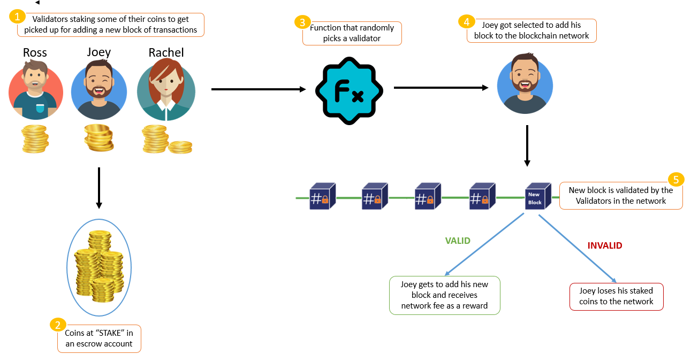

# Proof of Stake (PoS) in Blockchain

Proof of Stake (PoS) is a type of algorithm designed to achieve distributed consensus in a Blockchain. This method was first suggested by Quantum Mechanic and later developed into the Proof-of-Stake (PoS) based Peercoin by Sunny King and his peers.

## What is a Stake?

A stake is the value or money bet on a certain outcome in the PoS process, known as staking.

## Why Proof-of-Stake?

Before PoS, Proof-of-Work (PoW) was the most popular consensus mechanism, used in Bitcoin. However, PoW is energy-intensive, favoring entities with more computational resources. PoS, in contrast, offers a more energy-efficient alternative.

## How Proof-of-Stake Works

### Staking

Nodes on the network stake an amount of cryptocurrency to become candidates for validating new blocks. An algorithm then selects the validator based on the amount of stake and other factors such as coin-age or randomization.

### Coin-age Based Selection

The algorithm tracks how long each candidate node has been staking. The longer a node has been staking, the higher its chances of being selected as the new validator.

### Random Block Selection

The validator is chosen based on a combination of the lowest hash value and the highest stake.

### Workflow

1. Nodes make transactions, which are collected into a pool.
2. Nodes contend to become the validator for the next block by staking cryptocurrency.
3. The selected validator verifies all transactions and publishes the block.
4. If the block is approved by the network, the validator receives their stake back along with the transaction fees as a reward.
5. If the block is not approved, the validator loses their stake and the process restarts.

## Features of PoS

### Fixed Coins in Existence

There is a finite number of coins in circulation. No new coins are created as in PoW systems. Some networks start with PoW to introduce coins and then switch to PoS.

### Transaction Fee as Reward

Transaction fees are accumulated and given to the entity that forges a new block. If a block is found to be fraudulent, the validator loses their stake.

### Impracticality of the 51% Attack

To perform a 51% attack, an attacker would need to own 51% of the total cryptocurrency, which is prohibitively expensive and impractical.

## Advantages of PoS

1. **Energy-efficient:** No need for extensive computational power.
2. **Decentralization:** Reduced incentives to join mining pools, promoting decentralization.
3. **Security:** High cost of attacking the network due to the need for a majority stake.

## Weaknesses of PoS

1. **Large Stake Validators:** Large stakeholders can potentially centralize the network.
2. **New Technology:** PoS is relatively new and still under research.
3. **Nothing at Stake Problem:** Validators might support multiple blockchains during forks, leading to a lack of consensus.

## Blockchains Using Proof-of-Stake

- Ethereum (Casper update)
- Peercoin
- Nxt

## Variants of Proof-of-Stake

1. **Regular Proof-of-Stake:** The primary focus of this document.
2. **Delegated Proof-of-Stake**
3. **Leased Proof-of-Stake**
4. **Masternode Proof-of-Stake**

## Finding Solutions with Proof of Stake

PoS validators commit stake to attest blocks into existence. Validators run nodes to propose and attest blocks by staking crypto (e.g., ETH in Ethereum 2.0). Validators earn rewards for proposing blocks and making attestations.

### Penalties and Rewards

- Validators are penalized for being offline or malicious behavior.
- Proper participation results in net positive rewards.
- Attacks result in significant financial loss due to slashing of the staked amount.

## Addressing PoW Issues with PoS

### Accessibility

PoS requires staking a minimum amount of cryptocurrency to run a node, which can be lower than the hardware and electricity costs of PoW.

### Centralization

PoS reduces barriers to entry and eliminates concerns about electricity costs, promoting decentralization.

### Scalability

PoS enables the implementation of sharding, which partitions the blockchain into multiple chains to process transactions in parallel, significantly increasing transaction speed without compromising security.

## Example: Proof of Stake on Ethereum 2.0

Ethereum 2.0 uses PoS to improve scalability and security. Validators need to stake 32 ETH to run a node. The network requires a minimum threshold of staked ETH and committed validators to launch.

Validators earn rewards for proposing and attesting blocks once the network goes live. The sharding mechanism in Ethereum 2.0 partitions the blockchain into 64 separate chains, improving transaction processing speed.
