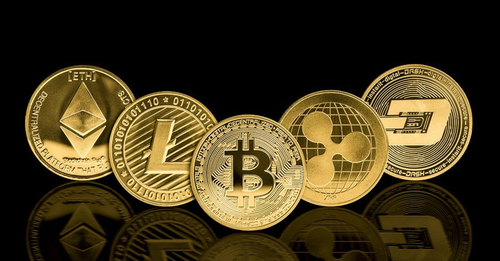

# Cryptocurrency: Meaning and Definition

## What is Cryptocurrency?

Cryptocurrency, sometimes called crypto-currency or crypto, is any form of currency that exists digitally or virtually and uses cryptography to secure transactions. Cryptocurrencies don't have a central issuing or regulating authority; instead, they use a decentralized system to record transactions and issue new units.

## How Does Cryptocurrency Work?

Cryptocurrencies run on a distributed public ledger called blockchain, a record of all transactions updated and held by currency holders.

- **Mining:** Units of cryptocurrency are created through a process called mining, which involves using computer power to solve complicated mathematical problems that generate coins.
- **Transactions:** Users can buy cryptocurrencies from brokers and then store and spend them using cryptographic wallets. Transactions are recorded in a public ledger.
- **Ownership:** Owning cryptocurrency means having a key that allows you to move a record or a unit of measure from one person to another without a trusted third party.

## Major Cryptocurrencies

### Bitcoin

- **Founded:** 2009
- **Founder:** Satoshi Nakamoto (pseudonym)
- **Overview:** Bitcoin was the first cryptocurrency and remains the most commonly traded. It operates on a decentralized ledger using blockchain technology.

### Ethereum

- **Founded:** 2015
- **Overview:** Ethereum is a blockchain platform with its own cryptocurrency, called Ether (ETH) or Ethereum. It supports smart contracts and decentralized applications (DApps).

### Litecoin

- **Founded:** 2011
- **Overview:** Litecoin is similar to Bitcoin but offers faster transaction times and a different hashing algorithm.

### Ripple (XRP)

- **Founded:** 2012
- **Overview:** Ripple is a distributed ledger system that supports various types of transactions, not just cryptocurrency. It has partnerships with numerous financial institutions.

## How to Buy Cryptocurrency

### Step 1: Choosing a Platform

- **Traditional Brokers:** Online brokers offering ways to buy and sell cryptocurrency along with other financial assets like stocks, bonds, and ETFs.
- **Cryptocurrency Exchanges:** Platforms offering various cryptocurrencies, wallet storage, interest-bearing account options, and more.

### Step 2: Funding Your Account

- **Payment Methods:** Most crypto exchanges allow purchases using fiat currencies like the US Dollar, British Pound, or Euro using debit or credit cards, ACH transfers, and wire transfers.
- **Fees:** Consider deposit and withdrawal transaction fees plus trading fees, which vary by platform and payment method.

### Step 3: Placing an Order

- **Order Types:** Buy and sell orders can be placed via the broker's or exchange's web or mobile platform. Payment services like PayPal, Cash App, and Venmo also support crypto transactions.

## How to Store Cryptocurrency

### Crypto Wallets

- **Hot Wallets:** Online software used to store the private keys to your cryptocurrencies.
- **Cold Wallets:** Offline electronic devices used to store private keys securely.

## What Can You Buy with Cryptocurrency?

Cryptocurrencies can be used to buy a variety of products, although large transactions are still rare. Some examples include:

- **Technology and E-commerce Sites:** Newegg, AT&T, Microsoft, Overstock, Shopify, Rakuten, and Home Depot.
- **Luxury Goods:** Online luxury retailer Bitdials accepts Bitcoin for high-end watches.
- **Cars:** Some car dealers accept cryptocurrency.
- **Insurance:** Swiss insurer AXA and Premier Shield Insurance accept Bitcoin for premium payments.

## Cryptocurrency Fraud and Scams

### Common Scams

- **Fake Websites:** Bogus sites with fake testimonials and promises of massive returns.
- **Virtual Ponzi Schemes:** Promoting non-existent investment opportunities.
- **"Celebrity" Endorsements:** Scammers posing as well-known figures to promote investments.
- **Romance Scams:** Persuading people met online to invest in virtual currencies.

### Protecting Yourself

- **Research:** Always research platforms and opportunities before investing.
- **Secure Storage:** Use reputable wallets and enable security features like two-factor authentication.
- **Stay Informed:** Keep up with the latest news on cryptocurrency scams and fraud prevention.

## Conclusion

Cryptocurrency represents a revolutionary shift in how we perceive and use money. Its decentralized nature, security through cryptography, and potential for various applications make it a significant technological advancement. However, it's essential to approach it with caution due to its volatility and the prevalence of scams.
