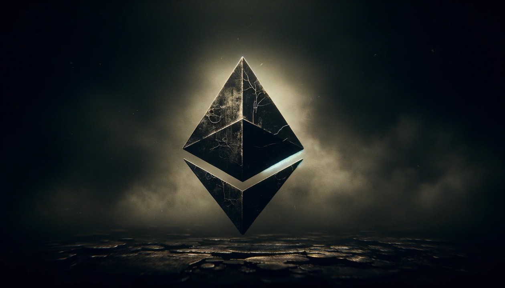

# Ethereum: A Comprehensive Overview

## Introduction to Ethereum

Ethereum is a decentralized blockchain platform that enables developers to build and deploy smart contracts and decentralized applications (dApps). It was proposed by Vitalik Buterin in late 2013 and development began in early 2014, with the network going live on July 30, 2015.

## Key Concepts

### Blockchain Technology

Ethereum operates on a blockchain, which is a distributed ledger that records all transactions across a network of computers. It ensures transparency and security by using cryptographic techniques such as hashing and digital signatures.

### Smart Contracts

Smart contracts are self-executing contracts with the terms of the agreement directly written into code. They automatically execute and enforce transactions when predefined conditions are met, without the need for intermediaries. Ethereum pioneered the concept of generalized smart contracts, allowing developers to create diverse applications beyond simple transactions.

### Decentralized Applications (dApps)

dApps are applications that run on a decentralized network of computers rather than a single central server. They leverage blockchain technology to provide transparency, security, and decentralization. Ethereum provides a platform for developers to build and deploy dApps that can range from financial applications, decentralized exchanges, gaming platforms, to supply chain management solutions.

## Ethereum Architecture

### Ethereum Virtual Machine (EVM)

The Ethereum Virtual Machine (EVM) is a decentralized computing environment that executes smart contracts. It runs on nodes all over the world, ensuring that computations are performed consistently and securely. The EVM is Turing complete, meaning it can execute any algorithmic function, enabling complex and customizable smart contracts.

### Consensus Mechanism

Ethereum initially used a Proof-of-Work (PoW) consensus mechanism similar to Bitcoin, where miners compete to validate transactions and create new blocks. However, Ethereum is transitioning to Proof-of-Stake (PoS) with Ethereum 2.0, which aims to improve scalability, security, and energy efficiency by allowing validators to propose and validate blocks based on the amount of ether they hold.

## Ether (ETH)

Ether is the native cryptocurrency of the Ethereum platform. It serves multiple purposes within the Ethereum ecosystem:
- **Fuel for Transactions:** Ether is used to pay for transaction fees and computational services on the Ethereum network.
- **Staking:** With Ethereum 2.0, ether holders can stake their coins to help secure the network and earn rewards.
- **Monetary Value:** Ether can be traded on cryptocurrency exchanges and used as a store of value similar to other cryptocurrencies.

## Use Cases and Applications

### Finance and DeFi

Ethereum has revolutionized the finance industry through decentralized finance (DeFi) applications. These include decentralized exchanges (DEXs), lending platforms, stablecoins, yield farming, and more, providing financial services without intermediaries.

### Gaming and NFTs

Ethereum is a popular platform for blockchain-based gaming and non-fungible tokens (NFTs). NFTs are unique digital assets that represent ownership of digital art, collectibles, virtual real estate, and more, leveraging Ethereum's smart contract capabilities for authenticity and ownership verification.

### Enterprise Solutions

Ethereum is also used for enterprise solutions, including supply chain tracking, identity verification, and decentralized governance applications. Enterprises benefit from Ethereum's transparency, security, and automation features for various business processes.

## Challenges and Future Developments

### Scalability

Scalability is a significant challenge for Ethereum due to limitations in transaction throughput and high gas fees during peak demand. Ethereum 2.0 aims to address these issues through sharding, which divides the network into smaller chains (shards) to process transactions in parallel.

### Regulatory Landscape

As blockchain technology evolves, governments and regulatory bodies are developing frameworks to govern cryptocurrencies and decentralized applications. Compliance and regulatory clarity are essential for Ethereum's long-term adoption and integration into mainstream finance.

## Conclusion

Ethereum has become a cornerstone of blockchain innovation, enabling developers to create decentralized applications and smart contracts that redefine industries and empower individuals worldwide. With ongoing upgrades and community-driven development, Ethereum continues to evolve, promising a future where decentralized technologies play a central role in global economic and social systems.

For more detailed technical specifications and updates, refer to the [official Ethereum website](https://ethereum.org/).
