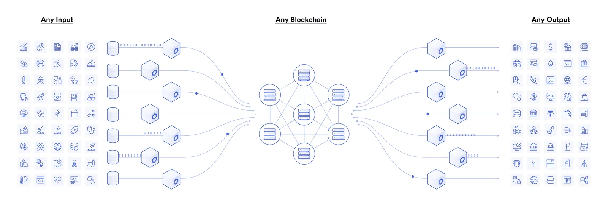
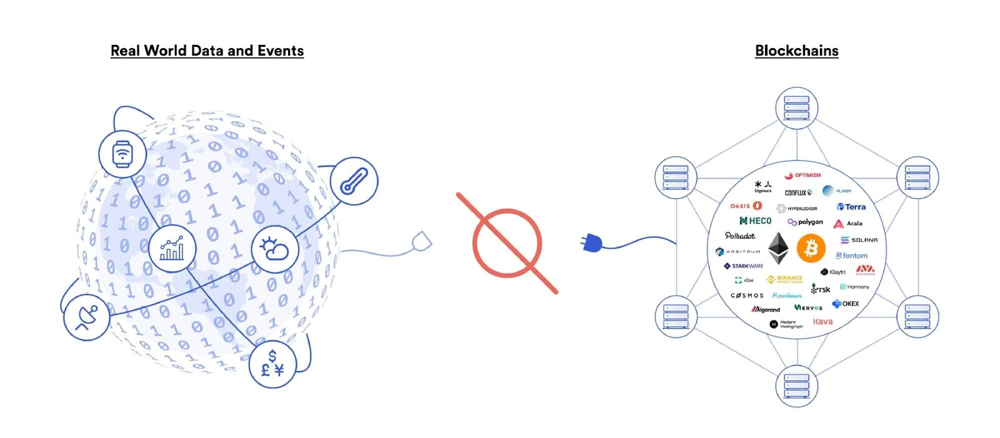

# Blockchain Oracle: Types, Uses, and How it Works

## What is an Oracle?

A blockchain oracle is a service that sends real-world data to a blockchain. For example, it can provide temperature readings or political vote counts to a blockchain. Smart contracts use this data to perform tasks automatically, such as dispensing funds when certain conditions are met. Oracles enable the decentralized web3 ecosystem to access existing data sources and perform advanced computations.

## Types of Oracle Database Editions

1. **Enterprise Edition**: The most robust and secure edition, offering all features with superior performance and security.
2. **Standard Edition**: Provides basic functionality without the comprehensive package of the Enterprise Edition.
3. **Express Edition (XE)**: A lightweight, free, and limited edition for Windows and Linux.
4. **Oracle Lite**: Designed specifically for mobile devices.
5. **Personal Edition**: Similar to the Enterprise Edition but lacks the Oracle Real Application Clusters feature.

## Problems with Blockchain

1. **Security**: Increased complexity in blockchain increases security challenges. For example, if someone gains access to one node in an exclusive blockchain, they can potentially access the entire data.
2. **Scalability**: Blockchain technology requires massive storage and secure systems, making scalability challenging.
3. **Transaction Speed**: While blockchain transactions can be fast, the decentralized nature can slow down everyday transactions due to the need for verification by multiple nodes.

## How Oracles Solve Blockchain Problems

Oracles solve these problems by providing reliable, third-party data sources for blockchain transactions. They collect and store data from the real world and send it to smart contracts when needed, ensuring the data is trusted by all nodes in the blockchain.

## Challenges with Oracles

1. **Trust Issues**: Oracles, being external data feeds, can introduce trust issues. If the data feed owner provides inaccurate data, it can lead to incorrect smart contract execution.
2. **Security Risks**: Oracles can be hacked, leading to manipulated data being fed into smart contracts.

## Types of Blockchain Oracles

1. **Software Oracles**: Gather data from online sources like servers and websites, providing up-to-date information such as currency exchange rates.
2. **Hardware Oracles**: Collect data from physical devices like sensors and barcode scanners, converting real-world events into machine-readable data.
3. **Inbound and Outbound Oracles**: Inbound oracles bring external data into the blockchain, while outbound oracles send data from smart contracts to the outside world.
4. **Human Oracles**: Experts in a field who verify and provide data to smart contracts.
5. **Contract-specific Oracles**: Designed for specific smart contracts, requiring separate oracles for each contract.
6. **Cross-chain Oracles**: Facilitate data and asset transfers between different blockchains.
7. **Compute-enabled Oracles**: Perform secure off-chain computations for decentralized services, often used in Layer2 solutions like ZK Rollups.
8. **Consensus-based Oracles**: Use multiple oracles and a consensus algorithm to ensure accurate data is fed into the blockchain.

## Oracle Design Patterns

1. **Immediate-read**: Provides data on a just-in-time basis for quick decision-making.
2. **Publish-subscribe**: Offers broadcast data services that can be polled by smart contracts or monitored off-chain for updates.
3. **Request-response**: Stores large amounts of data in smart contracts, allowing users to access small portions as needed.

## Use Cases of Blockchain Oracles

1. **Insurance**: Provide weather data for flight delay claims and crop insurance.
2. **DeFi**: Facilitate financial services without centralized control, such as home purchases or retirement plans.
3. **DApps**: Enable decentralized applications to interact with real-world data.
4. **NFTs**: Develop verifiable randomness functions to maintain NFT rarity.
5. **Cross-Chain Services**: Resolve interoperability issues between different blockchains.
6. **Banking, Stablecoins, and CBDCs**: Keep stablecoin prices updated and ensure collateralization is in check.

## Benefits of Blockchain Oracles

1. **Flexible Parameters**: Oracles can perform actions repeatedly or just once, and can passively report or actively take actions on the blockchain.
2. **Added Functionality**: Oracles enable blockchains to interact with external data, making them useful for everyday tasks like buying, selling, and investing.
3. **Time and Effort Savings**: Oracles automate smart contract execution based on external triggers, reducing the need for constant oversight.

## Risks of Blockchain Oracles

1. **Third-party Dependence**: Oracles introduce third-party intermediaries, which can lead to centralization issues.
2. **Incorrect Data**: Malicious actions or innocent mistakes can lead to incorrect data being fed into smart contracts, resulting in unfavorable decisions.

## Conclusion

The development of reliable blockchain oracles is crucial for the global rollout of blockchain technology. Without oracles, smart contracts would be limited to using only on-chain data. Decentralized oracle networks (DONs) can enhance the security and reliability of blockchain ecosystems by providing a trustworthy mechanism for integrating off-chain data.

## What Is an Oracle Network?

Decentralized oracle networks (DONs) enable the creation of hybrid smart contracts that combine on-chain code with off-chain infrastructure. This supports advanced decentralized applications (dApps) that react to real-world events and interoperate with traditional systems.

## Solving the Oracle Problem

The blockchain oracle problem highlights the limitation of smart contracts in interacting with off-chain data. Oracles bridge this gap by providing a secure and reliable means of fetching real-world data for smart contracts. This expands the types of digital agreements blockchains can support, benefiting industries like finance, insurance, gaming, supply chain, and government.

---

