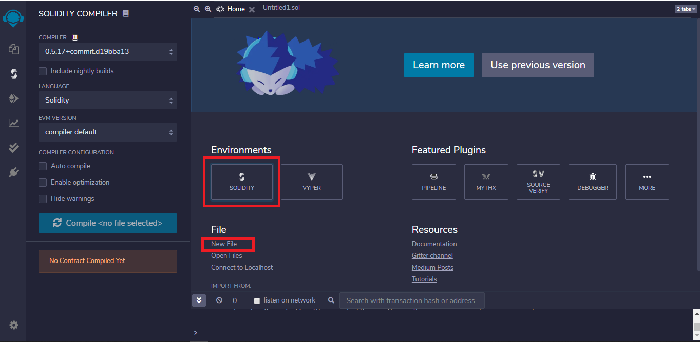
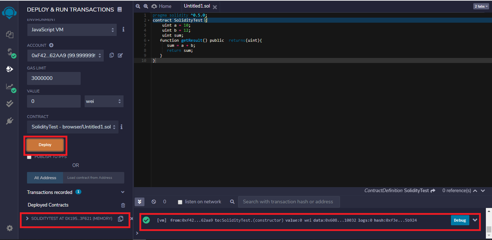
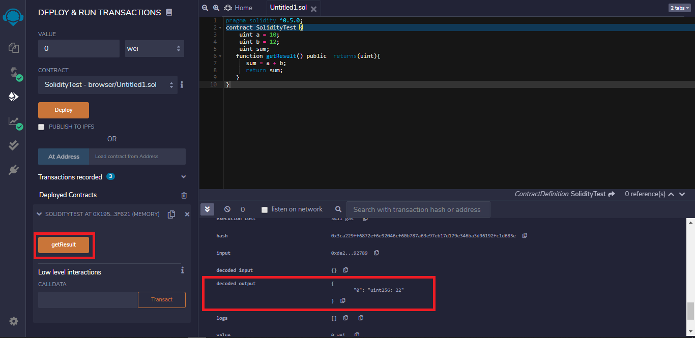
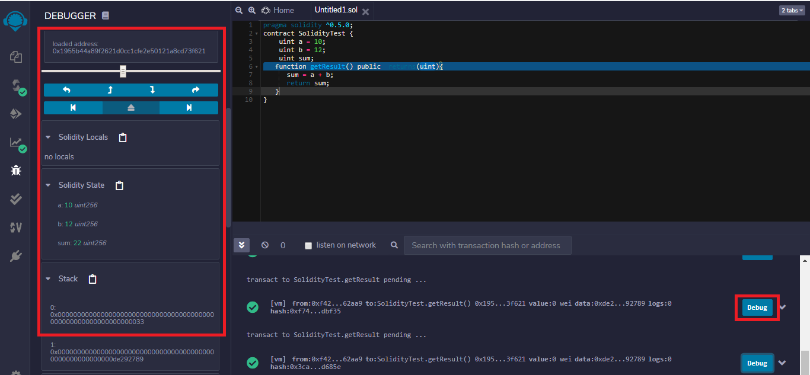

# Using Remix IDE for Solidity

## What is Remix IDE?

Remix IDE is an open-source web and desktop application that helps you write Solidity contracts straight from the browser. It provides an intuitive interface to create, deploy, and manage smart contracts for Ethereum and other EVM-compatible blockchains.

## Key Features of Remix IDE

- **Editor:** Write and edit your Solidity code with syntax highlighting and error checking.
- **Compiler:** Compile your Solidity code to check for errors and warnings.
- **Debugger:** Step through your smart contract's execution to diagnose and fix issues.
- **Deployment:** Deploy your smart contracts to the Ethereum blockchain or a local test network.
- **Plugin System:** Extend the functionality of Remix with plugins for various tasks.

## Getting Started with Remix IDE

### 1. Accessing Remix IDE

You can access Remix IDE directly in your browser by visiting [Remix IDE](https://remix.ethereum.org/). No installation is required.

### 2. Creating a New File

- Click on the `File Explorer` icon in the left-hand panel.
- Click the `+` icon to create a new file.
- Name your file with a `.sol` extension, for example, `MyContract.sol`.

---

# Steps to Execute Solidity Smart Contract using Remix IDE

Remix IDE is generally used to compile and run Solidity smart contracts. Below are the steps for the compilation, execution, and debugging of the smart contract.

#### NOTE : there might be some differences in images due to updated version

## Step 1: Open Remix IDE

Open Remix IDE on any of your browsers. Select `New File` and click on `Solidity` to choose the environment.

<p align="center">

</p>

## Step 2: Write the Smart Contract

Write the smart contract in the code section, and click the `Compile` button under the Compiler window to compile the contract.

```solidity
// SPDX-License-Identifier: GPL-3.0
pragma solidity ^0.5.0;

contract SolidityTest {
    uint a = 10;
    uint b = 12;
    uint sum;

    function getResult() public returns (uint) {
        sum = a + b;
        return sum;
    }
}
```

<p align="center">

</p>

## Step 3: Deploy the Smart Contract

To execute the code, click on the Deploy button under the Deploy and Run Transactions window.

<p align="center">

</p>

## Step 4: Execute the Deployed Contract

After deploying the code, click on the method calls under the drop-down of deployed contracts to run the program. For output, click on the drop-down on the console.

<p align="center">

</p>

## Step 5: Debug the Smart Contract

For debugging, click on the Debug button corresponding to the method call in the console. Here you can check each function call and variable assignments.

<p align="center">

</p>


## References
 - GFG
 - CodeEater
 - Notes