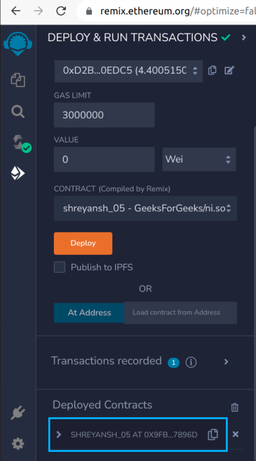

# MetaMask Usage with Solidity

## What is MetaMask?

MetaMask is a cryptocurrency wallet and browser extension that allows users to interact with the Ethereum blockchain. It serves as a wallet for storing Ethereum and ERC-20 tokens and integrates directly into web browsers to interact with decentralized applications (dApps) and smart contracts.

## Using MetaMask with Solidity

### 1. Install MetaMask

- Install MetaMask from [MetaMask's website](https://metamask.io/) for your preferred browser.
- Create or import a wallet account using a seed phrase.

### 2. Connecting to Ethereum Blockchain

- MetaMask connects you to the Ethereum mainnet by default.
- Switch networks (e.g., Ropsten, Rinkeby) using the network dropdown.

### 3. Interacting with dApps

- Navigate to Ethereum dApps like Uniswap or custom dApps.
- Connect MetaMask wallet to the dApp by clicking "Connect".

### 4. Using Solidity Smart Contracts

- Many dApps utilize smart contracts written in Solidity.
- MetaMask facilitates interaction with these contracts for actions like token swaps or asset lending/borrowing.

### 5. Sending Transactions

- Initiate transactions (e.g., sending ETH, interacting with smart contracts).
- MetaMask prompts for transaction details and confirmation before execution.

## Example Workflow

1. **Install MetaMask**: Go to [MetaMask](https://metamask.io/) and install the extension.
2. **Connect to Ethereum**: Switch to desired network (e.g., Ropsten).
3. **Interact with dApp**: Visit Uniswap, connect MetaMask, perform a token swap.
4. **Confirm Transactions**: MetaMask will prompt for transaction approval and execute.

After adding MetaMask as an extension in chrome and creating an account, set up your account as follows –

### Step 1: Select Sepolia Test Network from a list of available networks as below:

<p align="center">

</p>

### Step 2: Request test ether by using this link :

https://www.alchemy.com/faucets/ethereum-sepolia

To get sepolia Eth you must 0.001 real ETH in your mainnet account

<p align="center">

</p>

https://sepolia-faucet.pk910.de/

here you will get Sepolia Eth Free of cost not to pay anything

<p align="center">

</p>

### Step 3: MetaMask is ready for deployment. To know more about MetaMask visit the MetaMask official guide

# Steps to deploy your contract with MetaMask

### Step 1: Open Remix IDE in your browser. After opening click on + and write the filename as follows:

<p align="center">

</p>

### Step 2: Write the following sample code for testing and compile by clicking on the compile button as shown:

```Solidity
// SPDX-License-Identifier: MIT
pragma solidity ^0.8.17;

// Creating a contract
contract SampleContract
{
    // Defining a function
    function get_output() public pure returns (string memory){
        return ("Hi, your contract ran successfully");
    }
}
```

<p align="center">

</p>

### Step 3: After compilation and move to deploy section just below the compilation and select Injected Provider – MetaMask in place of Remix VM as shown below –

Select the Injected Provider – Metamask

<p align="center">

</p>

### Step 4: Now your contract is ready to be deployed. Click on deploy button and the MetaMask will ask for confirmation as follows –

Click the Confirm Button

<p align="center">

</p>

### Step 5: After confirmation, the deployed contract will look like –

Deployed Contract

<p align="center">

</p>

### Step 6: Expand the deployed contract as below and get the output using the get_output() function:

Output

<p align="center">

</p>

### Step 7: Now, to verify whether your transaction (process) executed successfully, you can check your balance on MetaMask.

also you can confirm transaction on
https://sepolia.etherscan.io/ by copying the hash.


## Referecnes
 - GFG
 - MetaMask
 - Notes