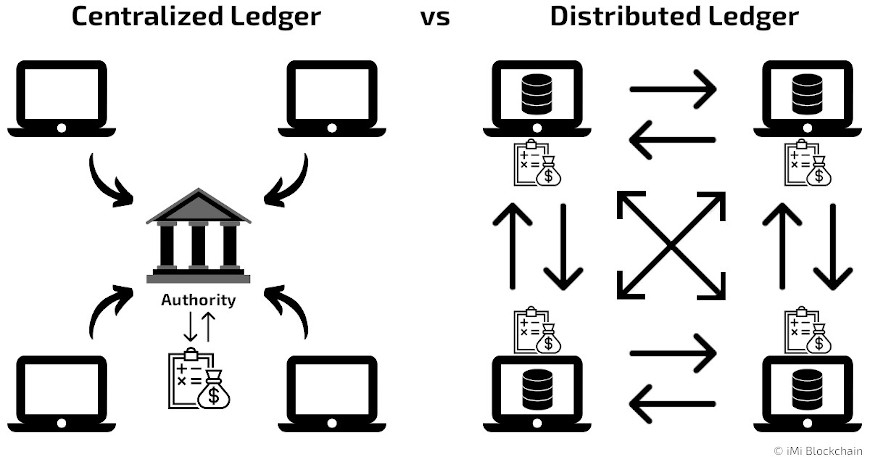

# Distributed Ledger Technology (DLT)

## Definition

Distributed Ledger Technology (DLT) is a digital system for recording the transaction of assets in which the transactions and their details are recorded in multiple places at the same time. Unlike traditional databases, distributed ledgers have no central data store or administration functionality. DLT refers specifically to the technological infrastructure and protocols that enable the simultaneous access, validation, and updating of records that characterize distributed ledgers.

  

## How DLT Works

DLT works based on principles of decentralization. Unlike traditional centralized databases, DLT operates on a peer-to-peer (P2P) network, where multiple nodes store, validate, and update the ledger simultaneously. This eliminates the need for a central authority and reduces the risk of a single point of failure.

### Key Features

- **Decentralized**: Every node maintains the ledger, and updates are independently processed at each node.
- **Immutable**: Data, once stored, cannot be altered or changed.
- **Append-only**: Data can only be added and not modified.
- **Distributed**: No central server or authority manages the database, making it transparent and decentralized.
- **Shared**: Accessible by multiple participants on the network.
- **Smart Contracts**: Enables self-executing contracts with the terms of the agreement directly written into code.
- **Fault Tolerance**: Highly resilient due to its decentralized nature.
- **Transparency**: Every participant can see the transactions, ensuring trust.
- **Efficiency**: Transactions can be processed and settled quickly.
- **Security**: Highly secure due to cryptographic signatures.

## Real-life Examples

### Banking and Finance

DLT is used in trade finance to implement smart contracts, facilitating seamless execution and settlement of trade transactions, reducing inefficiencies, and eliminating the need for intermediaries. Additionally, it enhances Know Your Customer (KYC) processes and provides secure digital identity solutions.

### Supply Chain Management

DLT helps track and verify the movement of goods, ensuring authenticity and preventing fraud. It provides real-time visibility into supply chain operations, reduces paperwork, and minimizes inefficiencies. For example, it can track the provenance of goods, ensuring ethical sourcing and enhancing consumer trust.

### Healthcare

DLT improves patient data management, streamlines processes, and enhances security. Medical records can be securely stored and shared, ensuring data privacy and integrity. Smart contracts can automate insurance claims, reducing administrative burdens and improving efficiency. DLT also ensures the integrity of data in clinical trials.

### Real Estate

DLT simplifies property transactions, reduces paperwork, and enhances security. Smart contracts automate property transfers, ensuring accurate and tamper-proof records of ownership. Blockchain platforms provide transparent and auditable property registries, reducing fraud and disputes.

### Other Industries

- **Energy**: Facilitates P2P energy trading and enables decentralized renewable energy systems.
- **Entertainment**: Revolutionizes royalty management and ensures fair compensation for artists.
- **Voting Systems**: Enhances the integrity and transparency of voting processes.
- **Intellectual Property Rights**: Ensures fair management and protection of intellectual property.

## Types of Distributed Ledger Technology

1. **Blockchain**: Bundles transactions into blocks that are chained together. Example: Bitcoin.
2. **Tangle**: Aimed at IoT ecosystems, it's feeless and scalable. Example: IOTA.
3. **Corda**: Designed for business, focusing on privacy.
4. **Hyperledger Fabric**: An open-source project for building blockchain applications.

## Comparison with Traditional Ledgers

### Advantages

- **Decentralization**: No single point of control or failure.
- **Transparency**: Every participant can verify transactions.
- **Security**: Immutable and cryptographically secured.
- **Efficiency**: Faster transaction processing and settlement.
- **Cost Reduction**: Eliminates intermediaries and reduces operational costs.

### Disadvantages

- **Scalability**: Performance issues as the number of transactions increases.
- **Interoperability**: Difficulty in achieving seamless data exchange between different DLT systems.
- **Regulatory Challenges**: Evolving legal frameworks and compliance issues.
- **User Education**: Requires technical knowledge for widespread adoption.

  

## Pros and Cons

### Pros

- Increased visibility and transparency.
- Lower operational costs.
- Faster transaction speeds.
- Reduced risk of fraudulent activities.
- High reliability and resiliency.
- Enhanced security.

### Cons

- Scalability issues.
- Interoperability challenges.
- Regulatory and legal uncertainties.
- Complexity and need for technical expertise.

# Multiple Choice Questions: Ledgers in Blockchain

## Question 1

**What is a primary characteristic of a distributed ledger?**

A. It is maintained by a single central authority.  
B. It allows data to be modified after it is recorded.  
C. It operates on a peer-to-peer (P2P) network.  
D. It does not require validation of transactions.

## Question 2

**Which of the following is NOT a feature of distributed ledger technology (DLT)?**

A. Decentralization  
B. Append-only data structure  
C. Centralized control  
D. Fault tolerance

## Question 3

**In the context of blockchain, what does immutability refer to?**

A. The ability to easily alter stored data  
B. The permanent record of transactions that cannot be changed  
C. The ability to delete records selectively  
D. The speed of transaction processing

## Question 4

**Which industry was an early leader in adopting distributed ledger technology (DLT)?**

A. Agriculture  
B. Healthcare  
C. Hospitality  
D. Fashion

## Question 5

**What consensus mechanism is primarily used in Bitcoin blockchain?**

A. Proof of Authority (PoA)  
B. Proof of Work (PoW)  
C. Proof of Stake (PoS)  
D. Directed Acyclic Graph (DAG)

---

**Answers:**

1. C - It operates on a peer-to-peer (P2P) network.
2. C - Centralized control
3. B - The permanent record of transactions that cannot be changed
4. B - Healthcare
5. B - Proof of Work (PoW)

## Conclusion

Distributed Ledger Technology (DLT) has the potential to revolutionize various industries by providing a decentralized, transparent, and secure method for recording transactions. While there are challenges to overcome, the benefits of DLT make it a promising technology for the future.

## References

- Google
- Blockchain Council
- Notes from YouTube
