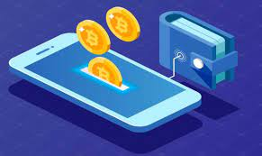

# Blockchain Wallet

## What is a Blockchain Wallet?

A blockchain wallet is a software that enables sending and receiving cryptocurrencies such as Bitcoin, Ethereum, etc. It stores the record of transactions and also public and private keys, which are used to perform transactions.

### Key Concepts

- **Public Key**: Similar to an account number. It can be shared with anyone to receive cryptocurrencies.
- **Private Key**: Similar to an account password. It is secret and used to send cryptocurrencies.

Public and private keys always come in pairs. While a traditional wallet stores currency, a blockchain wallet stores the record of transactions performed by the users and the public and private keys.

<!--  -->

## Features of Blockchain Wallet

- **Secure**: Carries the private key that needs to be secured.
- **Easy to Use**: Similar to digital wallets like Paytm.
- **Low Transaction Fees**: Lower cost than traditional bank transactions.
- **Instant Transactions**: Allows barrier-free and intermediary-free fund transfers.
- **Supports Multiple Cryptocurrencies**: Enables easy currency conversions.

## Why Use Blockchain Wallet?

- **Speed**: Traditional banking transactions are slow and pass through intermediaries.
- **Security**: Issues with traditional systems include data manipulation and corruption.
- **Trackability**: Blockchain wallets ensure secure and transparent transactions.

## How Do Blockchain Wallets Work?

When a blockchain wallet is created, it generates a public key and a private key. The public key is shared to receive funds, while the private key is used to send funds. Transactions can only be verified if the public key matches the private key.

### Example

- **Email Analogy**: Public key is like an email address, and private key is like the password. Public keys can be shared, but private keys must remain secret.

## Types of Blockchain Wallets

### Hot Storage

Connected to the Internet, allowing quick access but vulnerable to hacking. Types include:

- **Online (Cloud) Wallets**: Convenient but least secure. Examples: Bittrex, Coins.ph.
- **Desktop Wallets**: More secure than online wallets but vulnerable if the computer is compromised. Examples: Exodus, Bitcoin Core.
- **Mobile Wallets**: Easier to use than desktop wallets, but risk losing access if the phone is damaged. Examples: Jaxx, Mycelium.

### Cold Storage

Not connected to the Internet, offering higher security at the cost of convenience. Types include:

- **Hardware Wallets**: Store keys offline in a physical device. Examples: Ledger, Trezor.
- **Paper Wallets**: Store keys on paper, highly secure but vulnerable to physical damage. Examples: BitAddress.org.

### Multi-Signature Wallet

Requires multiple private keys to execute transactions, enhancing security and decentralization. Example: BitGo.

### Multi-Currency Wallet

Supports multiple cryptocurrencies and allows easy currency conversions. Example: Exodus.

## Criteria to Choose Blockchain Wallet

- **Usage Type**: Hot wallets for daily transactions, cold wallets for long-term storage.
- **Security**: Control private keys and store them locally or offline.
- **Compatibility**: Supports multiple operating systems.
- **Backup Features**: Provides a backup seed phrase and security features like passwords.
- **Ease of Use**: Simple interface and active development support.

## Benefits of Blockchain Wallets

- **No Geographic Barriers**: Facilitates borderless transactions.
- **No Intermediaries**: No central point of failure.
- **Lower Transaction Fees**: Cost-effective, especially for large transactions.
- **Security**: Enhanced privacy and security.
- **Simple Signups**: Easier setup compared to traditional bank accounts.
- **Easy Management**: Convenient to create and manage.

## Challenges of Using Blockchain Wallets

- **Low Acceptance**: Limited acceptance by retailers and merchants.
- **Price Fluctuation**: High volatility of cryptocurrencies.
- **Limited Network**: Support for legacy systems is limited.
- **Complicated Refunds**: Difficult to recover funds sent to the wrong address.
- **Securing Seed Phrase**: Security can be compromised if the seed phrase is not kept secure.

## Blockchain Wallet Comparison

- **Blockchain.info**: Supports Bitcoin and Ethereum, low transaction fees, API exposed.
- **Ledger Nano S**: Hardware wallet with high security, supports multiple cryptocurrencies.
- **Bitcoin Paper Wallet**: Tamper-resistant, minimizes hacking threats.
- **Jaxx**: Multi-currency wallet with currency exchange feature.

## Conclusion

Blockchain wallets provide secure, easy-to-use, and cost-effective ways to manage cryptocurrencies. They offer various types of storage options to cater to different needs, balancing security and convenience. Understanding the features and challenges of each type helps users choose the best wallet for their requirements.

---

## References

- Code Eater
- Google
- Notes from youtube
