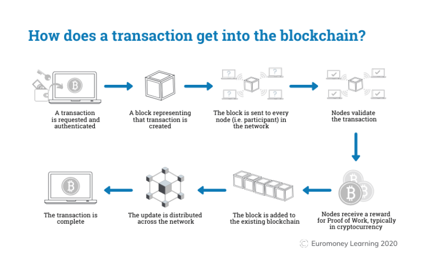

# Blockchain Transaction Life-cycle

Blockchain technology is mostly about the transactions that we make digitally for ourselves. Eventually, these transactions make their way to the various blocks that become part of the Blockchain later on. So, it is important to understand the transaction life cycle in Blockchain technology.

This lifecycle follows the journey of a single transaction as it makes its way through each stage in the process of joining the blockchain. Transaction in simple words is the process of sending money by the sender and the receiver receiving it. The Blockchain transaction is also quite similar, but it is made digitally.

Let us understand the various stages in a blockchain transaction life cycle with the help of an example.

Sourav and Suraj are two Bitcoin users. Sourav wants to send 1 bitcoin to Suraj.

1. **Initiation**: Sourav gets Suraj’s wallet address (a wallet in the blockchain is a digital wallet that allows users to manage their transactions). Using this information, he creates a new transaction for 1 bitcoin from his wallet and includes a transaction fee of 0.003 bitcoin.
2. **Verification**: Sourav verifies the information and sends the transaction. Each transaction that is initiated is signed by a digital signature of the sender that is basically the private key of the sender. This is done in order to make the transaction more secure and to prevent any fraud.
3. **Signing**: Sourav’s wallet then starts the transaction signing algorithm which signs his transaction using his private key.
4. **Broadcasting**: The transaction is now broadcasted to the memory pool within the network.
5. **Mining**: This transaction is eventually accepted by the miners. These miners group this transaction into a block, find the Proof of Work, and assign this block a hash value to be mapped into the blockchain.
6. **Block Addition**: This block is now placed on the Blockchain.
7. **Confirmation**: As this block gains confirmation, it is accepted as a valid transaction in the network.
8. **Completion**: Once this transaction is accepted, Suraj finally gets his bitcoin.

The below diagram is a pictorial representation of the various stages in a transaction life cycle as discussed above.

## Coinbase Transaction

A coinbase transaction is the first transaction in a block. It is a unique type of bitcoin transaction that can be created by a miner. The miners use it to collect the block reward for their work and any other transaction fees collected by the miner are also sent in this transaction.

### Explanation

Each transaction executed on the bitcoin network is combined together to form a block. When a block is formed, immediately, it will be added to the blockchain. Now, these blocks are immutable and tamper-proof for all transactions that are made on the bitcoin network. Each block must contain one or more transactions, and the first transaction in the block is called the coinbase transaction.

### Coinbase Transaction Details

The miners are always responsible for creating a block. When a block is successfully created, the miner will be rewarded from bitcoin for their work. The bitcoin block reward is always dependent on the number of blocks from the genesis block and the number of fees included in the transactions of the block. The total amount of rewards that a miner will collect is the sum of the block reward and the transaction fees taken from all the transactions that have been included in the block.

In the start of the bitcoin, the block reward was 50 bitcoin per block. The block reward is reduced by half after every 210,000 blocks, i.e. approximately every four years. The current reward for successfully creating a block is 12.5 bitcoin. It will be reduced to 6.25 bitcoin per block in the year 2020.

## What is a Blockchain Transaction?

A transaction captures details of an activity that has taken place on a blockchain. In the Ethereum blockchain and Ethereum-compatible blockchains, there are three types of transactions that can take place:

1. The transfer of cryptocurrency from one account to another.
2. Deployment of a smart contract.
3. Transacting with a smart contract.

The specifics of blockchain accounts and smart contracts will be discussed in subsequent articles, but it’s important to understand that there are only three types of transactions that can take place.

### Transaction Attributes

Transactions have the following key attributes:

- **Index**
- **Transaction hash**
- **Sender address**
- **Recipient address**
- **Amount**
- **Fee**
- **Data**
- **Events**

There are other fields associated with transactions, for instance, the creation of a transaction involves submitting a cryptographically signed transaction to the network and then processing a response message if successful, however, such protocol details are technical content we will not be covering here.

Transactions do not have a timestamp associated with them, as they are only considered to have taken place once the block they are contained within is produced. Transactions are however ordered in blocks by their index.

Transactions, like blocks, have a hash associated with them. As with block hashes, transaction hashes uniquely identify the contents of the transaction.

### Transaction Details

- **Sender address**: The wallet that initiated the transaction.
- **Recipient address**: The destination address for the transaction. This can be a wallet to receive cryptocurrency funds into, the address of a smart contract to transact with, or empty if we are deploying a new smart contract.
- **Amount**: The amount in the cryptocurrency of the network (for instance Ether) to be sent in the transaction.
- **Fee**: The amount the sender is willing to pay for the transaction to take place in the native cryptocurrency of the network. This is defined by two attributes — the gas price and the gas limit which are the amount per unit of computation you are willing to pay and the total amount of gas you are willing to spend (read What are gas fees? for more information).
- **Data**: The data field contains binary information relevant to the transaction. When sending cryptocurrency, it could be a message for the receiver, if deploying a smart contract it is the code of the contract, and when transacting with a smart contract it is details of the function invoked on the contract.
- **Events**: The events field provides information about any data output by the smart contract in the transaction.

The data and events fields are crucial sources of information, as it is from this that information such as token ownership is defined.

## Summary

A transaction represents an action taking place on a blockchain network. There are three types of transactions on Ethereum networks — the transfer of cryptocurrency from one account to another, the deployment of a smart contract, and interacting with a smart contract.

There are a number of fields that are contained within a transaction. Two of the key fields for interpreting activities that have taken place on the blockchain are the data and events fields.

## References

- Code Eater
- Google
- Notes from youtube
