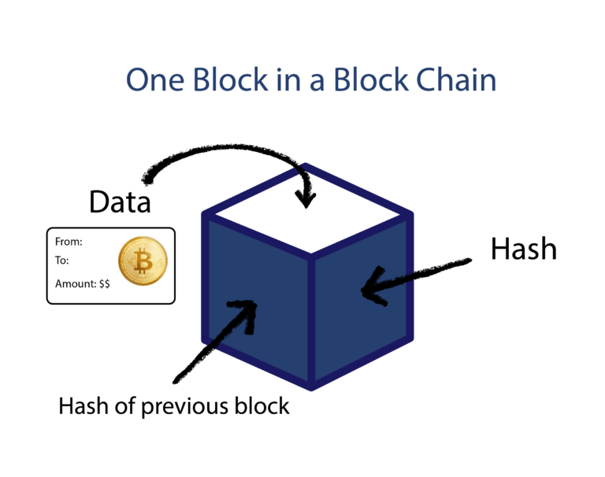
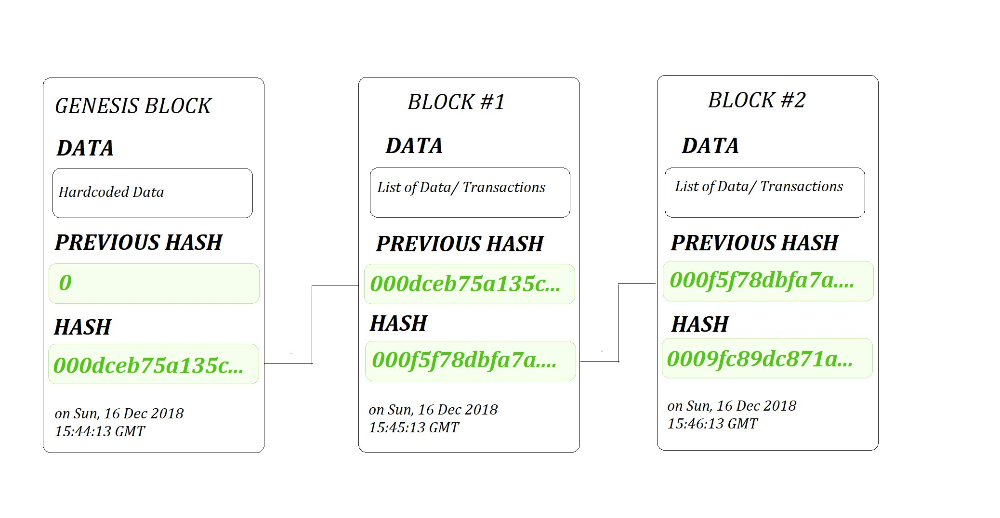

# Block in Blockchain

## What Is a Block in the Crypto Blockchain?

Blocks are files stored by a blockchain where transaction data are permanently recorded. A block records some or all of the most recent transactions not yet validated by the network. Once the data are validated, the block is closed, and a new block is created for new transactions to be entered into and validated.

A block is thus a permanent store of records that, once written, cannot be altered or removed without changing all preceding or following blocks.

### Key Takeaways

- A block is a file where information is stored and encrypted.
- Blocks are identified by long numbers that include encrypted transaction information from previous blocks and new transaction information.
- Blocks and the information within them must be verified by a network before new blocks can be created.
- Blocks and blockchains are not used solely by cryptocurrencies. They also have many other uses.

## How a Block Works

A blockchain network witnesses a great deal of transaction activity. The transactions made during a period are recorded into a file called a block, which is the basis of the blockchain network.

A block stores information. There are many pieces of information included within a block, but it doesn't occupy a large amount of storage space. Blocks generally include these elements, but it might vary between different types. For example, Bitcoin block structures include:

- **Blocksize**: Sets the size limit on the block so that only a specific amount of information can be written in it.
- **Block header**: Contains information about the block.
- **Transaction counter**: A field that lists how many transactions are stored in the block.
- **Transactions**: A list of all the transactions within a block.

### Block Header Sub-elements

The transaction element is the largest because it contains the most information. It is followed in storage size by the block header, which includes these sub-elements:

- **Version**: The cryptocurrency version being used, also called the magic number.
- **Previous block hash**: Contains a hash (encrypted number) of the previous block's header.
- **Merkle root**: Hash of transactions in the Merkle tree of the current block.
- **Timestamp**: A timestamp to place the block in the blockchain.
- **Difficulty Target**: The difficulty rating of the target hash, signifying the difficulty in generating a hash that is equal to or less than the target.
- **Nonce**: A number the miner increases incrementally when hashing.

### Mining's Relationship to Blocks

Mining is the term used for solving the cryptographic puzzle, which acts as the first verification for transactions and proof that work was done to do the verification.

Cryptocurrency mining is commonly thought to be solving a complex mathematical problem; mining is actually sending block data through a hashing algorithm (which uses complicated math functions) to generate a hexadecimal number.

## Structure of a Block

### Conceptual Structure

A block in a blockchain conceptually contains the following elements:

- **Block Height**: It's the sequence number of the block in the chain of blocks. Block Height: 1 is the genesis block (first block in the network).
- **Block Size**: A 4-bytes or 32-bit field that contains the size of the block.
- **Block Reward**: The amount rewarded to the miner for adding a block of transactions.
- **Tx Count**: The transaction counter shows the number of transactions contained by the block.

### Block Header Components

The Block header is an 80-Byte field that contains the metadata – the data about the block. It includes:

- **Time**: The digitally recorded moment of time when the block has been mined.
- **Version**: A 4-bytes field representing the version number of the protocol used.
- **Previous Block Hash**: A 32-bytes field containing a 256-bits hash of the previous block.
- **Bits**: A 4-bytes field that tells the complexity to add the block. Also known as "difficulty bits."
- **Nonce**: A 4-bytes field containing a 32-bit number. These are the only changeable element in a block of transactions.
- **Merkle Root**: A 32-bytes field containing a 256-bit root hash. It's constructed hierarchically combining hashes of the individual transactions in a block.

### Transactions

Each block contains a variable-size field that includes the list of all transactions contained in the block. Each bitcoin block contains about 2000 transactions. The size of each block is approx 1MB. The size and number of transactions in a block vary in blockchains.

## Blockchain and Block Header

Blockchain is a database, or broadly distributed database, used mainly for concurrent transactions. One of the most popular implementations of blockchain is Bitcoin. Blockchain has several blocks, also called nodes, and all the blocks are managed with the help of the block header.

### Constituents of Block Header

- **Timestamp**: Used as proof of the particular block's time of use.
- **Version**: Tracks the software/protocol upgrades.
- **Merkle Root**: Uses mathematical formulas to check if the data is not corrupted.
- **Difficulty Target**: Specifies the complexity and the computational power required to mine the network.
- **Nonce**: A number that blockchain miners are finding.
- **Previous Hash**: Stores the hashed value of the previous node’s address.

## Other Uses and Developments

### Blockchain Impacts for Individuals

One of the most significant impacts of blockchains on individuals is access to financial services. Blockchains allow individuals to control how their personal information is used.

### Blockchain Impacts for Businesses

Businesses in all sectors are exploring ways to use blockchains. Insurance companies can use it to facilitate insurance claims and fraud investigations. Intellectual property rights can be protected, and international businesses can make faster and cheaper cross-border payments using blockchain.

## Questions

1. **What is a block in a blockchain?**

   - A. A single transaction
   - B. A file where information is stored and encrypted
   - C. A user in the blockchain network
   - D. A mining algorithm

2. **Which of the following is NOT a typical component of a block header?**

   - A. Version
   - B. Timestamp
   - C. Merkle Root
   - D. Block Reward

3. **What does the nonce in a block header represent?**

   - A. The difficulty level of mining the block
   - B. The hash of the previous block
   - C. A number the miner increases incrementally when hashing
   - D. The total size of the block

4. **What is the primary purpose of the Merkle Root in a block?**

   - A. To determine the block size
   - B. To serve as a unique identifier for the block
   - C. To verify the integrity of the transactions in the block
   - D. To store the timestamp of the block

5. **What does "proof-of-work" (PoW) refer to in the context of blockchain?**

   - A. A method to validate transactions without mining
   - B. A mechanism to prevent double-spending
   - C. A process of solving cryptographic puzzles to validate transactions
   - D. A type of transaction fee

6. **Which field in the block header contains the hash of the previous block?**

   - A. Nonce
   - B. Timestamp
   - C. Previous Block Hash
   - D. Merkle Root

7. **What is the term used for the first block in a blockchain?**

   - A. Origin Block
   - B. Genesis Block
   - C. Initial Block
   - D. Primary Block

8. **How is the difficulty target in a blockchain generally adjusted?**

   - A. Based on the number of transactions
   - B. According to the miner's computational power
   - C. By the total number of blocks in the blockchain
   - D. Depending on how fast the network can hash

9. **Which of the following best describes a blockchain?**

   - A. A centralized database
   - B. A distributed ledger of transactions
   - C. A single file with encrypted data
   - D. A public key infrastructure

10. **What happens to a block once the data within it are validated?**
    - A. The block is deleted
    - B. The block is closed and added to the blockchain
    - C. The block's transactions are reversed
    - D. The block is encrypted and stored offline

## Answers

1. **B. A file where information is stored and encrypted**
2. **D. Block Reward**
3. **C. A number the miner increases incrementally when hashing**
4. **C. To verify the integrity of the transactions in the block**
5. **C. A process of solving cryptographic puzzles to validate transactions**
6. **C. Previous Block Hash**
7. **B. Genesis Block**
8. **D. Depending on how fast the network can hash**
9. **B. A distributed ledger of transactions**
10. **B. The block is closed and added to the blockchain**

---

### Conclusion

Blocks are the basic constructs of blockchain. Each block contains a set of transactions, metadata, and mining information. Blockchain technology is continuously evolving, impacting both individuals and businesses by providing secure, transparent, and efficient ways to handle data and transactions.

## References

- Code Eater
- Google
- Notes from youtube