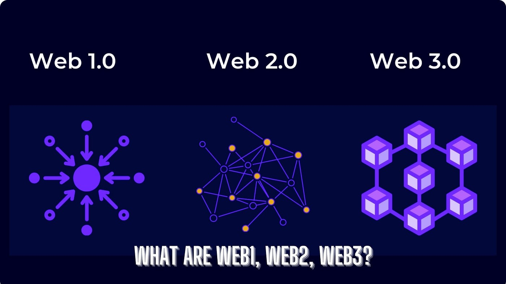
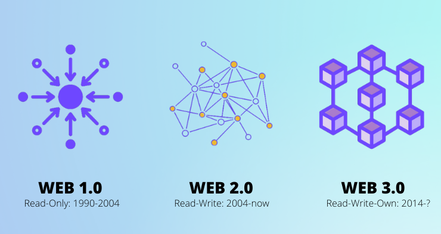
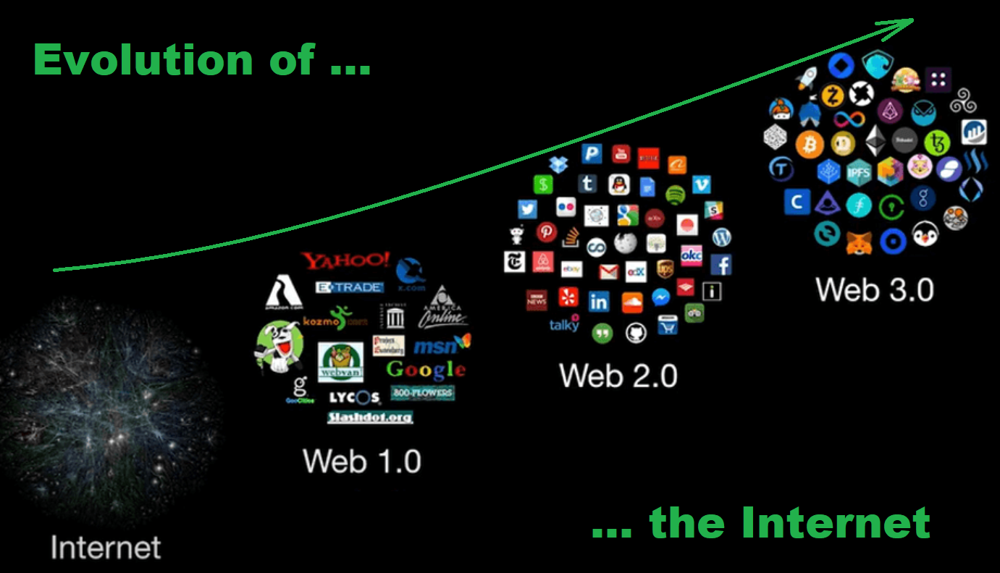

# Understanding Web1, Web2, and Web3

The evolution of the web can be divided into three main stages: Web1, Web2, and Web3. Each stage has distinct characteristics and functionalities that reflect the technological advancements and changing user needs over time.

## Web1 (Web 1.0)

### Overview

Web1, also known as Web 1.0, represents the earliest stage of the World Wide Web's development. It spanned from the early 1990s to the early 2000s. Web1 was characterized by static web pages that were primarily informational. Content was created by a few content creators and consumed by many users.

### Characteristics

- **Static Pages**: The web pages were static with fixed content.
- **Read-Only**: Users could only view and read information; there was no interaction.
- **HTML and CSS**: Built using simple HTML and CSS.
- **Hyperlinking**: Basic hyperlinking between static pages.
- **No User Interactivity**: No commenting, liking, or sharing.

### Real-Life Example

- **Geocities**: A popular web hosting service where users could create simple web pages.
- **Personal Websites**: Basic websites that contained personal information, resumes, and contact information.

## Web2 (Web 2.0)

### Overview

Web2, or Web 2.0, marks the transition to a more interactive and social web. This phase began in the mid-2000s and continues today. It is characterized by user-generated content, interactivity, and social media.

### Characteristics

- **Dynamic Content**: Web pages are dynamic and can change based on user interaction.
- **User Interaction**: Users can interact with content through comments, likes, and shares.
- **Social Media**: Platforms like Facebook, Twitter, and Instagram.
- **APIs and Web Services**: Integration of various services and applications.
- **Rich User Experience**: Enhanced by AJAX, JavaScript, and more complex front-end technologies.

### Real-Life Example

- **Facebook**: A social networking site where users can create profiles, post content, and interact with others.
- **YouTube**: A video-sharing platform where users can upload, comment on, and share videos.
- **Wikipedia**: A collaborative encyclopedia where users can edit and contribute to articles.

## Web3 (Web 3.0)

### Overview

Web3, or Web 3.0, represents the next phase of the internet, focusing on decentralization, blockchain technology, and a more semantic web. This stage aims to create a more intelligent and connected web experience.

### Characteristics

- **Decentralization**: Uses blockchain technology to create decentralized applications (dApps).
- **Semantic Web**: Enhanced data connectivity and understanding, allowing machines to interpret data meaningfully.
- **Cryptocurrencies**: Digital currencies like Bitcoin and Ethereum facilitate transactions.
- **Smart Contracts**: Self-executing contracts with terms directly written into code.
- **Enhanced Privacy**: Greater focus on user privacy and data security.

### Real-Life Example

- **Ethereum**: A decentralized platform that enables smart contracts and dApps.
- **Brave Browser**: A web browser that focuses on privacy and uses blockchain to reward users with cryptocurrency.
- **Decentralized Finance (DeFi)**: Financial applications built on blockchain technology, such as lending platforms and exchanges.

## Comparison: Web1 vs Web2 vs Web3

| Feature                  | Web1 (Web 1.0)               | Web2 (Web 2.0)                   | Web3 (Web 3.0)                   |
| ------------------------ | ---------------------------- | -------------------------------- | -------------------------------- |
| **Era**                  | 1990s - Early 2000s          | Mid-2000s - Present              | Emerging (2020s)                 |
| **Content Type**         | Static                       | Dynamic                          | Decentralized                    |
| **User Interaction**     | Read-Only                    | Read-Write                       | Read-Write-Own                   |
| **Technology**           | HTML, CSS                    | AJAX, JavaScript, APIs           | Blockchain, Smart Contracts      |
| **Data Storage**         | Centralized Servers          | Centralized Servers              | Decentralized Networks           |
| **Key Examples**         | Geocities, Personal Websites | Facebook, YouTube, Wikipedia     | Ethereum, Brave Browser, DeFi    |
| **Main Focus**           | Information Distribution     | User Participation, Social Media | Decentralization, User Ownership |
| **Privacy and Security** | Low                          | Moderate                         | High                             |
| **Business Model**       | Advertising, Static Content  | Advertising, User Data           | Tokens, Cryptocurrency           |

Understanding the distinctions between Web1, Web2, and Web3 helps us appreciate the rapid evolution of the internet and its increasing impact on our daily lives. Each phase has brought significant advancements, leading to more interactive, participatory, and decentralized web experiences.

